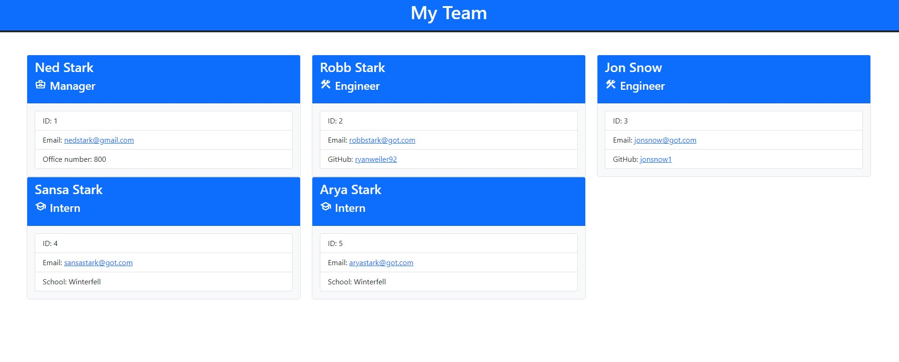

# Team Profile Generator

## Description
The Team Profile Generator provides a unique service that allows the user to keep track of all of their team members in an organized and presentable fashion. Enter your team manager and all of your engineers and interns through easy to understand prompts. The application will collect and display data for names, email addresses, employee ID's, GitHub accounts, office numbers and schools. The application will take this information and create an HTML page for you.

## Table of Contents
* [Installation](#installation)
* [Usage](#usage)
* [Contributors](#contributors)
* [Tests](#tests)
* [Questions](#questions)
* [License](#license)

## Installation
The installation process is very simple. First you will need to download the repository from GitHub. Second you will have to make sure that you have node.js installed. Then open the terminal in your prefered method and call Node Index.js to begin the prompt process.

## Usage
You will be required to enter information for all of the prompts. 

For video instructions please visit click [here](https://drive.google.com/file/d/1OpikPcfGQrqtNp29UsV0Yco6Rs-KIFXX/view).

## Contributors
Ryan Weiler

## Tests 
No testing available at this time.

## Questions
* GitHub User Name: [ryanweiler92](https://github.com/ryanweiler92)
* Application Link: [Team Profile Generator](https://github.com/ryanweiler92/Team-Profile-Generator)
* For any additional questions please reach out to ryanweiler92@gmail.com.

## License
  